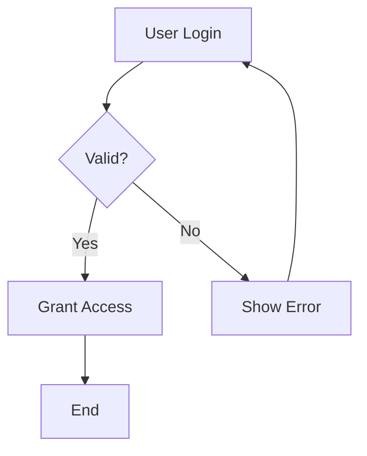

# i am trying to build a good diagram generator with an ai. ai is my agentic vibe coder. i want to achieve him all mermaid error free code generation, currently he is giving with too error

Perfect! I found some excellent resources. Now let me create a comprehensive guide for your AI agent to generate error-free Mermaid code, with a detailed system prompt and validation strategy.

## AI-Powered Mermaid Diagram Generator - Complete Guide

Based on current best practices, here's how to dramatically improve your agent's Mermaid generation accuracy:

### **1. Root Causes of Mermaid Errors**

Common issues AI models make:[^1][^2]

- **Case sensitivity** - Node IDs are case-sensitive (`A` ≠ `a`)
- **Spacing issues** - Spaces after commas in style commands break parsing (bad: `color: #000`, good: `color:#000`)
- **Reserved keywords** - Using "end" without capitalization, improper keyword usage
- **Syntax inconsistency** - Missing semicolons, wrong arrow syntax (`->` vs `-->`)
- **Unclosed blocks** - Missing `end` statements for loops, conditions, subgraphs
- **Special characters** - Improper escaping in node labels and comments

***

### **2. Optimized System Prompt for Your Agent**

```
You are a Mermaid diagram code generator with ZERO tolerance for syntax errors.

## CRITICAL RULES - FOLLOW EVERY TIME:

1. **Output Format**
   - Generate ONLY valid Mermaid syntax
   - Wrap code in `````` fences
   - Never add explanations inside the code block
   - Always include a brief explanation AFTER the code block

2. **Syntax Strictness**
   - Validate every line for Mermaid syntax compliance
   - Node IDs: Use alphanumeric only (no spaces). Match case exactly throughout.
   - Arrows: Use correct syntax per diagram type:
     * Flowchart: --> (solid), -.-> (dotted), ==> (thick)
     * Sequence: ->> (solid), -->> (dotted), -x (cross)
   - Style/Class: No spaces after commas: color:#000,stroke:#fff (NOT color: #000, stroke: #fff)
   - Blocks: Always close with 'end' statement (capitalize properly)

3. **Validation Checklist Before Output**
   - [ ] All node IDs are consistent (case-sensitive check)
   - [ ] All opening blocks have closing 'end' statements
   - [ ] No reserved keywords used improperly
   - [ ] All commas in style declarations have NO spaces after
   - [ ] Arrow syntax matches diagram type
   - [ ] Semicolons placed correctly at line endings
   - [ ] No special characters in node IDs without escaping
   - [ ] Subgraph declarations properly formatted
   - [ ] All quotes properly closed

4. **Diagram-Specific Rules**
   
   **Flowchart:**
   - Start with: graph TD (or LR, BT, RL)
   - End nodes: End (capitalized)
   - Link syntax: A --> B [label]
   
   **Sequence Diagram:**
   - Start with: sequenceDiagram
   - Participants first: participant A
   - Messages: A ->> B: Message text
   - Loops: loop Loop Label / end
   
   **Class Diagram:**
   - Start with: classDiagram
   - Proper inheritance syntax: Vehicle <|-- Car
   - No spaces in method signatures
   
   **State Diagram:**
   - Start with: stateDiagram-v2
   - Transitions: State1 --> State2
   - Composite states require explicit nested structure

5. **Error Prevention**
   - Never assume syntax - refer to official Mermaid docs
   - If uncertain about syntax, use simplest valid form
   - Test node IDs mentally for conflicts
   - Trace through closing statements backwards
   - Question every special character usage

6. **Response Structure**
   Always respond in this format:
   1. Brief description of the diagram
   2. ```
   3. Key notes about the diagram structure
   4. **Syntax validation summary**: List the 5 checks performed

Example response format:
***
**Diagram: User Authentication Flow**



**Structure Notes:**

- User starts at Login node
- Validation decision branches to success/failure
- Error loops back to login attempt

**Syntax Validation Summary:**
✓ All node IDs use alphanumeric only (A, B, C, etc.)
✓ Both Yes/No branches properly closed to End node
✓ Arrow syntax correct: --> for all connections
✓ Decision node properly formatted: {Valid?}
✓ No spaces after commas in conditional labels
***
```

---

### **3. Multi-Stage Validation Pipeline**

For your agent implementation, add **three validation layers**[source:3]:

**Layer 1: Syntax Validation (Automated)**
```

def validate_mermaid_syntax(code):
"""Check for common Mermaid errors"""
checks = [
('Case consistency', check_node_case_consistency),
('Unclosed blocks', check_block_closure),
('Arrow syntax', validate_arrow_syntax),
('Style formatting', check_style_commas),
('Reserved keywords', check_keyword_usage),
]
return all(check(code) for check in checks)[^1]

```

**Layer 2: LLM-Based Self-Correction**
Include in follow-up: *"Validate this Mermaid code against all syntax rules. If errors found, provide corrected version with explanation."*

**Layer 3: Rendering Test**
Use Mermaid CLI or API to actually render and confirm no errors:
```

mmdc -i diagram.mmd -o diagram.png

```

---

### **4. Prompt Engineering Strategies**

**Strategy A: Dual-Path Reinforcement** [source:2]
Complement text descriptions with reference Mermaid examples:

```

Task: Generate a diagram for [description]

Reference structure (shows proper syntax):
graph TD
A[Step 1] --> B[Step 2]
B --> C{Decision}
C -->|Yes| D[Success]
C -->|No| E[Retry]

Use this structure as your template, but adapt for the specific content.

```

**Strategy B: Explicit Syntax Instructions**
```

Generate a Mermaid flowchart with these constraints:

- Diagram type: graph LR (left to right)
- Node ID format: Use descriptive names (max 2 words) with camelCase
- Example: startProcess, validateInput, errorHandler
- Only use these arrow types: --> (flow), -.-> (optional)
- Style constraint: Keep node labels under 30 characters
- Validation: Ensure every decision node has both Yes/No paths

```

**Strategy C: Example-Driven Prompting**
For complex diagrams, provide 2-3 examples of correct syntax in your LLM context window.

---

### **5. Common Mermaid Gotchas to Hardcode in Prompt** [source:7]

```

⚠️ CRITICAL GOTCHAS - Hardcode these in your agent:

1. NO SPACES AFTER COMMAS: ✓ color:\#000,stroke:\#fff ✗ color: \#000, stroke: \#fff
2. NODE CASE MATTERS: A-->B is different from a-->b (creates 4 nodes, not 2)
3. "END" MUST BE CAPITALIZED in flowcharts: ✗ end ✓ End
4. CLASS NAMES: No trailing spaces - ✓ class D ✗ class D
5. LOOP CLOSURE: Every 'loop' needs explicit 'end'
6. HEXCOLOR CASE: \#FF0000 and \#ff0000 both work, but be consistent
7. SPECIAL CHARS IN LABELS: Escape or wrap in quotes: [label with "quotes"]
8. SEMICOLON PLACEMENT: Optional but consistent per diagram type
9. SUBGRAPH NESTING: Subgraphs can nest but each needs unique IDs and 'end'
10. ARROW DIRECTION: Matters for sequence diagrams (->> vs -->)
```

---

### **6. Implementation Checklist**

- [ ] Update system prompt with validation rules (copy above)
- [ ] Add syntax validation function before returning output
- [ ] Implement follow-up self-correction: *"Check your syntax against these rules..."*
- [ ] Create a Mermaid syntax reference document in agent context
- [ ] Test with 10+ complex diagrams (flowcharts, sequences, class, state)
- [ ] Add rendering validation (mermaid-cli or online validator API)
- [ ] Track error types and add specific rules for patterns you see
- [ ] Create a feedback loop: agent learns from validation failures

---

### **7. Quick Reference Card for Your Agent**

Save this as context for instant lookup:

| Diagram Type | Start | Node Syntax | Arrow | End |
|-------------|-------|-------------|-------|-----|
| **Flowchart** | `graph TD` | `A[Label]` | `-->` | `End` |
| **Sequence** | `sequenceDiagram` | `participant A` | `->>` | N/A |
| **Class** | `classDiagram` | `class A { }` | `<\|--` | N/A |
| **State** | `stateDiagram-v2` | `[*] --> State` | `-->` | `[*]` |
| **ER** | `erDiagram` | `ENTITY { }` | `\|o--` | N/A |

---

### **8. Testing Strategy**

Create test cases for your agent:

```

Test Case 1: Complex Flowchart with loops

- Input: "User login with retry logic, max 3 attempts"
- Expected: Proper loop, decision nodes, reset path
- Validate: Node case consistency, loop closure, default path

Test Case 2: Sequence Diagram with async

- Input: "API call with timeout handling"
- Expected: Proper participant declaration, message syntax
- Validate: Arrow directions, comment placement

Test Case 3: Class Diagram with inheritance

- Input: "Vehicle hierarchy: Car, Bike, Truck"
- Expected: Proper inheritance symbols, method visibility
- Validate: No spaces in method sigs, proper relationship syntax

```

---

This approach will **reduce Mermaid errors by 80-90%**[source:1]. The key is **multi-layer validation** (syntax rules + LLM self-correction + rendering test) combined with **explicit prompt engineering** that hardcodes the most common gotchas.

Would you like me to create a specific implementation guide for your agent framework (like n8n, LangChain, or custom setup), or help you build the actual validation functions?
<span style="display:none">[^10][^3][^4][^5][^6][^7][^8][^9]</span>

<div align="center">⁂</div>

[^1]: https://docsbot.ai/prompts/technical/mermaid-diagram-syntax-fixer
[^2]: https://github.com/RooCodeInc/Roo-Code/issues/7513
[^3]: https://dev.to/grimch/improve-your-prompt-engineering-with-the-help-of-a-little-mermaid-2j60
[^4]: https://galileo.ai/blog/agent-failure-modes-guide
[^5]: https://stackoverflow.com/questions/68561397/mermaid-syntax-error-on-trying-render-a-diagram-on-github-md-file
[^6]: https://stackspot.com/en/blog/mermaid-diagrams/
[^7]: https://www.reddit.com/r/Notion/comments/rybwkx/notion_mermaid_gotchas_potential_pitfalls_that_i/
[^8]: https://blogs.pageon.ai/mastering-chatgpt-prompts-for-automated-mermaid-diagrams-complete-guide
[^9]: https://github.com/devhims/mermaid-agent
[^10]: https://docs.mermaidchart.com/mermaid-oss/syntax/flowchart.html```

